# Introduction

Spectroscopy datasets often consist of high-dimensional measurements
across different wavelengths or wavenumbers, structured in wide-format
tables where each column represents a sample and each row corresponds to
a spectral position. The
[tidyspec](https://marceelrf.github.io/tidyspec) package provides a
tidyverse-friendly toolkit designed to streamline the processing,
visualization, and analysis of such spectral data in R.

By building on top of the [dplyr](https://dplyr.tidyverse.org),
[ggplot2](https://ggplot2.tidyverse.org), and
[tidyr](https://tidyr.tidyverse.org) ecosystems,
[tidyspec](https://marceelrf.github.io/tidyspec) simplifies common
workflows such as baseline correction, unit conversion, normalization,
filtering, and principal component analysis (PCA). It enforces
consistent treatment of spectral dimensions using a customizable
reference column (typically wavenumber or wavelength), which can be
easily set using
[`set_spec_wn()`](https://marceelrf.github.io/tidyspec/reference/set_spec_wn.md).

This vignette demonstrates a typical usage of the package, from
importing and visualizing spectral data to performing PCA and
interpreting results. The functions included are designed to make
spectral analysis in R more transparent, reproducible, and user-friendly
for both beginners and advanced users.

## Instalation

``` r
remotes::install_github("marceelrf/tidyspec")
```

## Package overview

The package organizes utilities into 6 families, all prefixed with
`spec_`:

**1. Transformation**  
[`spec_abs2trans()`](https://marceelrf.github.io/tidyspec/reference/spec_abs2trans.md):
Convert absorbance to transmittance.
[`spec_trans2abs()`](https://marceelrf.github.io/tidyspec/reference/spec_trans2abs.md):
Convert transmittance to absorbance.

**2. Normalization**  
[`spec_norm_01()`](https://marceelrf.github.io/tidyspec/reference/spec_norm_01.md):
Normalize spectra to range \[0, 1\].
[`spec_norm_minmax()`](https://marceelrf.github.io/tidyspec/reference/spec_norm_minmax.md):
Normalize to a custom range.
[`spec_norm_var()`](https://marceelrf.github.io/tidyspec/reference/spec_norm_var.md):
Scale to standard deviation = 1.

**3. Baseline Correction**  
[`spec_blc_rollingBall()`](https://marceelrf.github.io/tidyspec/reference/spec_blc_rollingBall.md):
Correct baseline using rolling ball algorithm. `spec_blc_irls()`:
Correct using Iterative Restricted Least Squares. `spec_bl_*()`: Return
baseline vectors (e.g., `spec_bl_rollingBall`).

**4. Smoothing**  
[`spec_smooth_avg()`](https://marceelrf.github.io/tidyspec/reference/spec_smooth_avg.md):
Smooth with moving average.
[`spec_smooth_sga()`](https://marceelrf.github.io/tidyspec/reference/spec_smooth_sga.md):
Smooth using Savitzky-Golay.

**5. Derivative**  
[`spec_diff()`](https://marceelrf.github.io/tidyspec/reference/spec_diff.md):
Compute spectral derivatives.

**6. Preview & I/O**  
[`spec_smartplot()`](https://marceelrf.github.io/tidyspec/reference/spec_smartplot.md):
Static preview of spectra.
[`spec_smartplotly()`](https://marceelrf.github.io/tidyspec/reference/spec_smartplotly.md):
Interactive preview (`{Plotly}`).
[`spec_read()`](https://marceelrf.github.io/tidyspec/reference/spec_read.md):
Import from .csv, .txt, .xlsx, etc.

``` r
library(tidyspec)
library(tidyverse)
```

## Data

The `CoHAspec` dataset is a spectral table in wide format, where:

Rows: Wavenumbers (in cm⁻¹).

Columns: Samples (CoHA01, CoHA025, CoHA05, CoHA100).

Values: Absorbance/intensity measurements.

Here’s a preview of the data:

``` r
CoHAspec
#> # A tibble: 1,868 × 5
#>    Wavenumber CoHA01 CoHA025 CoHA05 CoHA100
#>         <dbl>  <dbl>   <dbl>  <dbl>   <dbl>
#>  1       399.  0.871   1.36   1.17    1.05 
#>  2       401.  0.893   1.24   1.05    0.925
#>  3       403.  0.910   1.20   0.997   0.876
#>  4       405.  0.914   1.19   0.982   0.867
#>  5       407.  0.908   1.18   0.965   0.857
#>  6       409.  0.887   1.14   0.936   0.828
#>  7       411.  0.856   1.08   0.902   0.791
#>  8       413.  0.819   1.03   0.865   0.748
#>  9       415.  0.789   0.988  0.838   0.717
#> 10       417.  0.768   1.000  0.860   0.735
#> # ℹ 1,858 more rows
```

### Wavenumber Handling

The function `set_spec_wn` simplifies the use of functions by globally
defining the column that contains the wave numbers. User can check the
wavenumber column with `check_wn_col`.

``` r
set_spec_wn("Wavenumber")
#> Successfully set 'Wavenumber' as the default wavenumber column.
check_wn_col()
#> The current wavenumber column is: Wavenumber
```

## Visualize the data

Scientists who work with spectroscopy data always want to visualize it
after each operation. That’s why we created the `spec_smartplot` and
`spec_smartplotly` functions to help users.

`spec_smartplot` creates a static visualization of the spectra, while
`spec_smartplotly` creates an interactive visualization, allowing the
user to navigate through the values of the different data.

``` r
spec_smartplot(CoHAspec)
#> Warning: wn_col not specified. Using default value: Wavenumber.
#> This message is shown at most once every 2 hours.
#> Warning: xmin not specified. Using default value: 399.1992.
#> This message is shown at most once every 2 hours.
#> Warning: xmax not specified. Using default value: 3999.706.
#> This message is shown at most once every 2 hours.
```


Static spectral plot showing all samples

``` r
spec_smartplotly(CoHAspec,geom = "line")
```

These functions simplify the process by automating it, but we invite
users to make their own figures for presentations and publications. As
part of the efforts to create a community of `tidyspec` users, we plan
to create a `ggplot2` extension for high-level spectroscopy graphics.
For now, you can produce `ggplot2` graphs by pivoting the data:

``` r
CoHAspec %>% 
  tidyr::pivot_longer(cols = -Wavenumber,
                      names_to = "spectrums",
                      values_to = "absorbance") %>% 
  ggplot(aes(x = Wavenumber, y = absorbance, col = spectrums)) +
  geom_line() #<------ Customize your data from here
```


Custom ggplot2 visualization of spectral data

## Convert to transmittance (and back to absorbance)

The functions `spec_abs2trans` and `spec_trans2abs` are designed to
easily convert the spectras.

``` r
CoHAspec %>% 
    spec_abs2trans() %>%
    spec_smartplot()
```

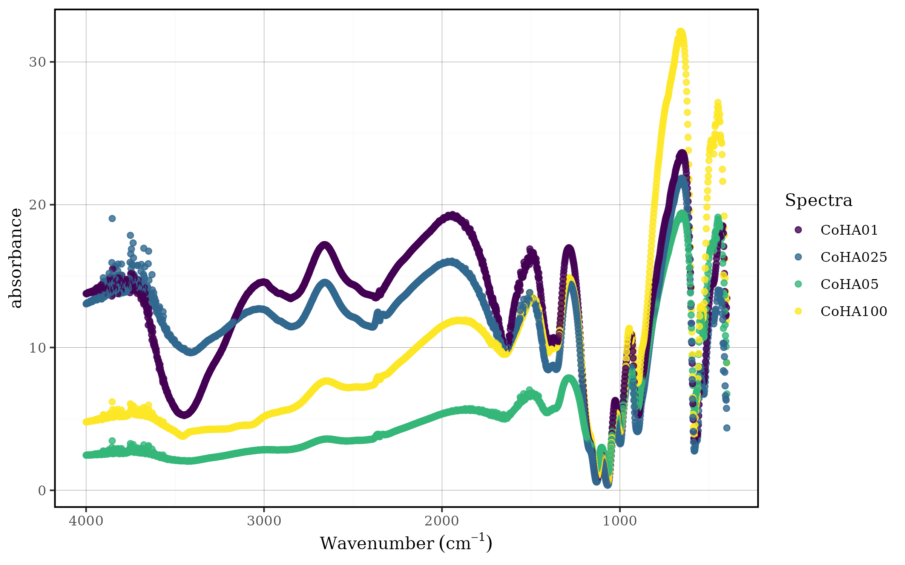

``` r
CoHAspec %>% 
    spec_abs2trans() %>%
    spec_trans2abs() %>%
    spec_smartplot()
```

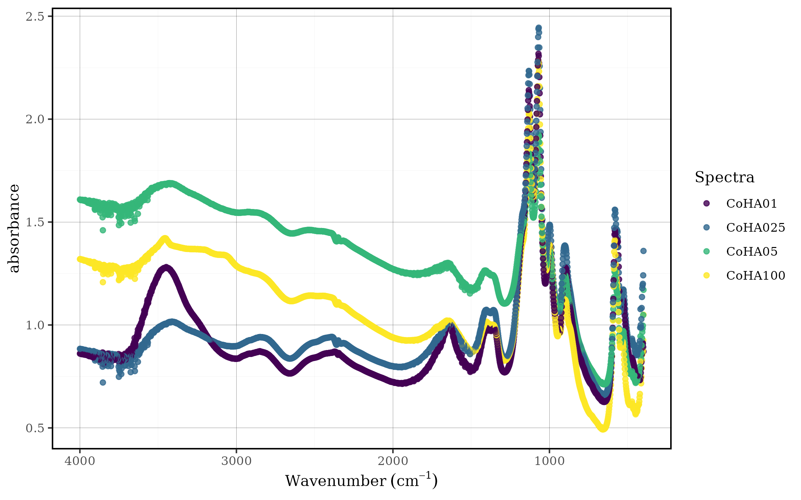

## Select spectra

`Tidyspec` is designed to be easily integrated with the entire
`tidyverse` ecosystem. Then the user can easily choose which spectra to
keep/discard using
[`dplyr::select`](https://dplyr.tidyverse.org/reference/select.html).

``` r
CoHAspec %>% 
    dplyr::select(Wavenumber,CoHA100) %>%
    tidyspec::spec_smartplot()
```


However, since `tidyspec` needs the column containing the wave numbers
and the user could end up messing up and not keeping it during
operations, we decided to develop `spec_select` which simplifies the
process.

``` r
CoHAspec %>% 
    tidyspec::spec_select(CoHA100) %>%
    tidyspec::spec_smartplot()
```

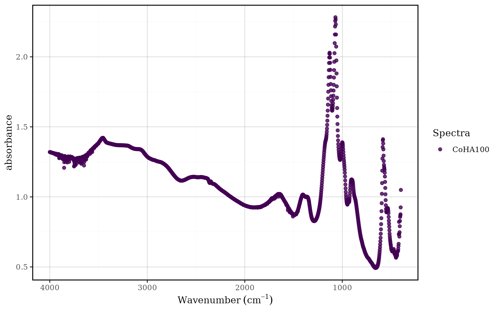

## Filter spectra

Similarly to the spectrum selection process, filtering regions of the
spectrum can be done using
[`dplyr::filter`](https://dplyr.tidyverse.org/reference/filter.html).

``` r
CoHAspec_filt <- 
    CoHAspec %>% 
    tidyspec::spec_select(CoHA100) %>%
    dplyr::filter(Wavenumber > 1000,
                Wavenumber < 1950)
```

`spec_filter` simplifies the process of filtering the desired regions.

``` r
CoHAspec_filt <- 
    CoHAspec %>% 
    spec_select(CoHA100) %>%
    spec_filter(wn_min = 1000,
                wn_max = 1950)

spec_smartplot(CoHAspec_filt, geom = "line")
```


## Smoothing the data

Spectroscopic data often contains noise that can interfere with analysis
and interpretation. Smoothing techniques help reduce this noise while
preserving the essential spectral features. The `tidyspec` package
provides two main smoothing methods: moving averages and Savitzky-Golay
filtering.

### Moving averages method

The moving average method
([`spec_smooth_avg()`](https://marceelrf.github.io/tidyspec/reference/spec_smooth_avg.md))
is one of the simplest and most intuitive smoothing techniques. It works
by replacing each data point with the average of its neighboring points
within a specified window size. This method is particularly effective
for reducing random noise while maintaining the overall shape of
spectral peaks.

#### How it works:

- For each point, it calculates the mean of surrounding points within a
  defined window  
- Larger windows provide more smoothing but may blur important
  features  
- Smaller windows preserve detail but provide less noise reduction

#### Parameters:

- `wn_col`: Column name for wavelength data (default: “Wn”)  
- `window`: Window size for the moving average (default: 15)  
- `degree`: Polynomial degree for smoothing (default: 2)

``` r
CoHAspec_filt %>% 
  spec_smooth_avg() %>%
  spec_smartplot(geom = "line")
```

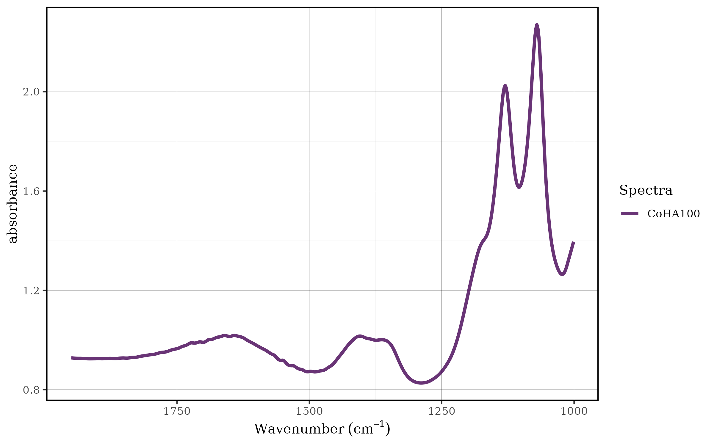

### Savitz-Golay method

The Savitzky-Golay filter
([`spec_smooth_sga()`](https://marceelrf.github.io/tidyspec/reference/spec_smooth_sga.md))
is a more sophisticated smoothing technique that is particularly
well-suited for spectroscopic data. Unlike simple moving averages, this
method fits a polynomial to a local subset of data points and uses this
polynomial to estimate the smoothed value. This approach is especially
effective at preserving peak shapes, heights, and widths while reducing
noise.

#### How it works:

- For each data point, it fits a polynomial of specified degree to
  nearby points within a window  
- The smoothed value is calculated from this local polynomial fit  
- This preserves the underlying spectral features better than simple
  averaging  
- The method can also calculate derivatives directly during the
  smoothing process

#### Parameters:

- `wn_col`: Column name for wavelength data (default: “Wn”)  
- `window`: Window size for smoothing (default: 15, should be odd)  
- `forder`: Polynomial order for fitting (default: 4)  
- `degree`: Degree of differentiation (default: 0 = smoothing only)

``` r
CoHAspec_filt %>% 
  spec_smooth_sga() %>%
  spec_smartplot(geom = "line")
```


### Comparison with moving average:

- Savitzky-Golay: Better peak preservation, more computationally
  intensive
- Moving average: Faster computation, simpler implementation, more peak
  distortion

## Derivatives

Differentiation of spectral data is a fundamental technique in
chemometrics that allows for highlighting specific spectral features,
reducing baseline effects, and improving the resolution of overlapping
peaks. The
[`spec_diff()`](https://marceelrf.github.io/tidyspec/reference/spec_diff.md)
function implements numerical differentiation for spectral data,
offering flexibility to calculate first-order or higher-order
derivatives.

### Using the `spec_diff()` Function

The
[`spec_diff()`](https://marceelrf.github.io/tidyspec/reference/spec_diff.md)
function accepts the following arguments:

- `.data`: A data.frame or tibble containing spectral data
- `wn_col`: A character string specifying the column name for the
  wavelength data (default: “Wn”)
- `degree`: A numeric value specifying the degree of differentiation. If
  degree = 0, the original data is returned without any changes

Example:

``` r
CoHAspec_filt %>% 
    tidyspec::spec_smooth_sga() %>%
    spec_diff(degree = 2) %>%
    tidyspec::spec_smartplot(geom = "line")
#> Warning: Removed 2 rows containing missing values or values outside the scale range
#> (`geom_line()`).
```

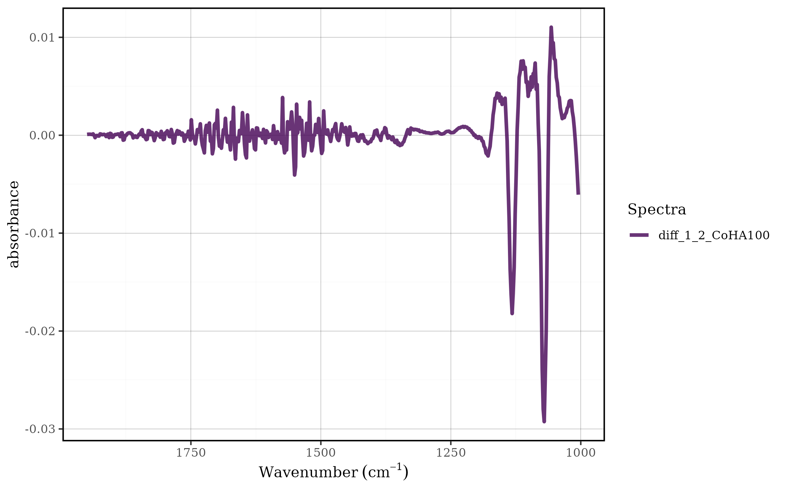

In this pipeline:

1.  The filtered spectral data (CoHAspec_filt) is first smoothed using
    the Savitzky-Golay algorithm

2.  Then, a second-order derivative is applied using
    `spec_diff(degree = 2)`

3.  The result is visualized through
    [`spec_smartplot()`](https://marceelrf.github.io/tidyspec/reference/spec_smartplot.md)
    with line geometry

## Baseline correction

Baseline correction is a crucial preprocessing step in spectral analysis
that removes systematic variations in the baseline that are not related
to the analyte of interest. These baseline variations can arise from
instrumental drift, scattering effects, sample positioning, or optical
interferences. Proper baseline correction enhances spectral quality and
improves the accuracy of subsequent quantitative and qualitative
analyses.

### Rolling ball method

The rolling ball algorithm is a popular baseline correction technique
that estimates the baseline by “rolling” a virtual ball of specified
radius beneath the spectrum. This method is particularly effective for
correcting baselines with smooth, curved variations and is widely used
in various spectroscopic applications.

#### Function Parameters

The
[`spec_blc_rollingBall()`](https://marceelrf.github.io/tidyspec/reference/spec_blc_rollingBall.md)
function provides comprehensive control over the baseline correction
process:

- `.data`: A data.frame or tibble containing spectral data
- `wn_col`: Column name for wavelength data (default: “Wn”)
- `wn_min`: Minimum wavelength for baseline correction range
- `wn_max`: Maximum wavelength for baseline correction range
- `wm`: Window size of the rolling ball algorithm (controls ball radius)
- `ws`: Smoothing factor of the rolling ball algorithm
- `is_abs`: Logical indicating if data is in absorbance format

#### Baseline Correction Application

The following example demonstrates baseline correction applied to a
specific wavelength range:

``` r
CoHAspec_filt %>% 
    spec_smooth_sga() %>%
    spec_blc_rollingBall(wn_min = 1030,
                         wn_max = 1285,
                         ws = 10,
                         wm = 50) %>%
    tidyspec::spec_smartplot(geom = "line")
```


In this pipeline:

1.  Smoothing is applied first to reduce noise  
2.  Rolling ball correction is performed in the 1030-1285 cm⁻¹ range  
3.  Window size (wm = 50) and smoothing factor (ws = 10) are optimized
    for the data

### Looking to the baseline

To better understand the correction process, we can examine the
estimated baseline using
[`spec_bl_rollingBall()`](https://marceelrf.github.io/tidyspec/reference/spec_bl_rollingBall.md):

``` r
CoHAspec_filt %>% 
    spec_smooth_sga() %>%
    spec_bl_rollingBall(wn_col = "Wavenumber",
                        wn_min = 1030,
                        wn_max = 1285,
                        ws = 10,
                        wm = 50) %>% 
  spec_smartplot()
```


This visualization shows only the estimated baseline, allowing you to
assess whether the algorithm properly captures the underlying baseline
trend.

#### Comparing Original and Baseline

For a comprehensive view of the correction process, we can overlay the
original spectrum with the estimated baseline:

``` r
bl <- CoHAspec_filt %>% 
    spec_smooth_sga() %>%
    spec_bl_rollingBall(wn_col = "Wavenumber",
                         wn_min = 1030,
                         wn_max = 1285,
                         ws = 10, wm = 50)

CoHAspec_filt %>%
  spec_smooth_sga() %>%
  spec_filter(wn_min = 1030, wn_max = 1285) %>% 
  left_join(bl) %>% 
  spec_smartplot(geom = "line")
#> Joining with `by = join_by(Wavenumber, CoHA100)`
```


This comparison allows you to:

- Evaluate the baseline estimation quality
- Identify regions where the algorithm may need parameter adjustment
- Verify that the baseline follows the expected spectral trend

## Scaling the spectra

Spectral scaling (normalization) is a preprocessing technique that
standardizes spectral data to facilitate comparison between samples and
improve the performance of multivariate analysis methods. Different
scaling approaches address various sources of systematic variation in
spectral data, such as differences in sample concentration, path length,
or instrumental response.

### Importance of Spectral Scaling

Scaling is essential when:

\_ Sample concentrations vary: Different analyte concentrations can mask
spectral patterns \_ Path lengths differ: Variations in sample thickness
affect overall intensity \_ Instrumental variations exist: Different
measurement conditions create systematic offsets \_ Multivariate
analysis is planned: Many chemometric methods assume standardized data
\_ Pattern recognition is the goal: Scaling emphasizes spectral shape
over absolute intensity

### Working with a Spectral Region

For demonstration purposes, we’ll work with a specific spectral region
that contains relevant analytical information:

``` r
CoHAspec_region <- CoHAspec  %>%
    dplyr::filter(Wavenumber > 1300,
                Wavenumber < 1950) 
CoHAspec_region %>% 
    spec_smartplot(geom = "line")
```

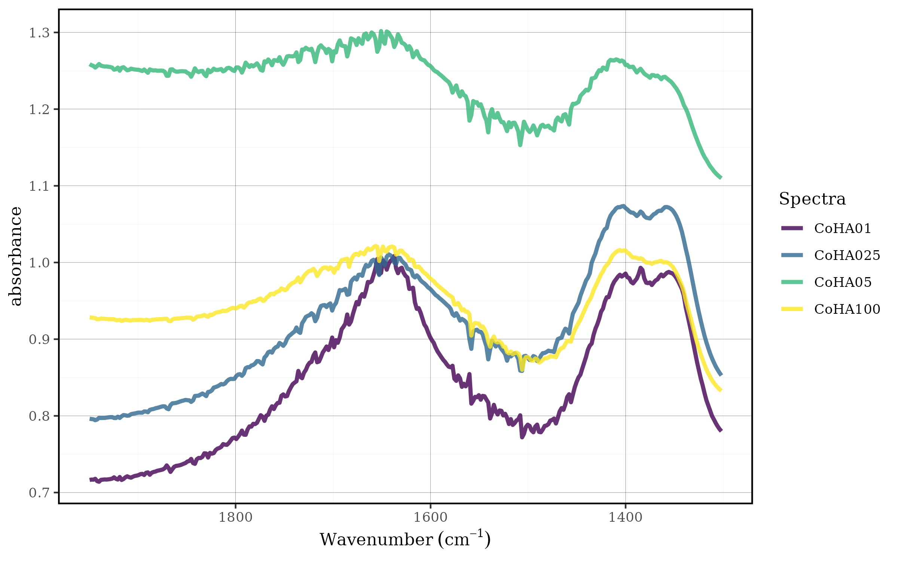

This region (1300-1950 cm⁻¹) is selected to focus on specific spectral
features while avoiding regions that might contain noise or irrelevant
information.

### Min-Max Normalization (0-1 Scaling)

Min-max normalization scales each spectrum to a range between 0 and 1,
preserving the relative relationships between spectral intensities while
standardizing the dynamic range.

#### Mathematical Foundation

For each spectrum, the transformation is:

- Normalized value = (Value - Minimum) / (Maximum - Minimum)
- Results in values ranging from 0 to 1
- Preserves the original spectral shape

``` r
CoHAspec_region %>%
    spec_norm_01() %>% 
    spec_smartplot(geom = "line")
```

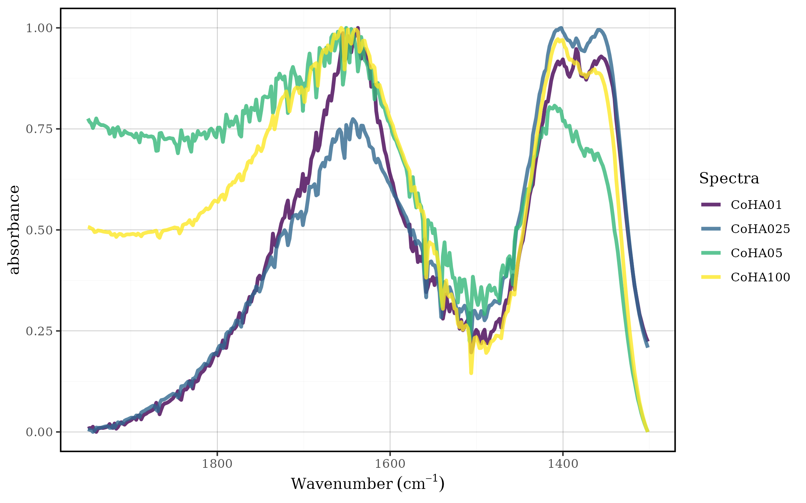

The
[`spec_norm_01()`](https://marceelrf.github.io/tidyspec/reference/spec_norm_01.md)
function:

- Finds the minimum and maximum values for each spectrum
- Applies the min-max transformation
- Maintains spectral shape while standardizing intensity range
- Is particularly useful when absolute intensity differences are not
  analytically relevant

#### When to Use Min-Max Normalization

Min-max scaling is ideal when:

- You want to preserve spectral shape
- Absolute intensities vary due to concentration differences
- Visual comparison of spectral patterns is important
- The dynamic range needs standardization

The user can set any min and max value with the
[`spec_norm_minmax()`](https://marceelrf.github.io/tidyspec/reference/spec_norm_minmax.md)
function:

``` r
CoHAspec_region %>%
    spec_norm_minmax(min = 1, max = 2) %>% 
    spec_smartplot(geom = "line")
```


### Standardization (Z-score Normalization)

Standardization transforms each spectrum to have a mean of 0 and
standard deviation of 1, emphasizing deviations from the average
spectral response.

#### Mathematical Foundation

For each spectrum, the transformation is:

- Standardized value = (Value - Mean) / Standard Deviation
- Results in mean = 0 and variance = 1
- Emphasizes relative variations around the mean

#### Application

``` r
CoHAspec_region %>%
    spec_norm_var() %>% 
    spec_smartplot(geom = "line")
```

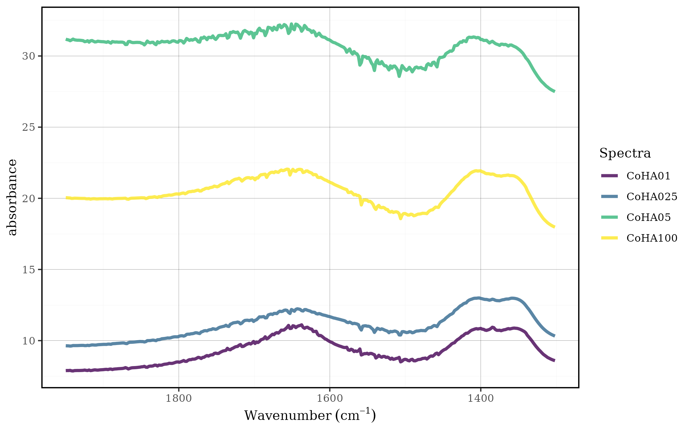

The
[`spec_norm_var()`](https://marceelrf.github.io/tidyspec/reference/spec_norm_var.md)
function:

- Calculates the mean and standard deviation for each spectrum
- Applies z-score transformation
- Centers the data around zero
- Standardizes the variance across all spectra

#### When to Use Standardization

Standardization is appropriate when:

- You want to emphasize spectral variations
- Baseline shifts need to be removed
- Multivariate analysis requires standardized inputs
- Focus is on relative changes rather than absolute values

### Choosing the Right Scaling Method

The choice between scaling methods depends on your analytical
objectives:

| Method          | Best for                                      | Preserves           | Emphasizes           |
|-----------------|-----------------------------------------------|---------------------|----------------------|
| Min-Max (0-1)   | Pattern recognition, visual comparison        | Spectral shape      | Relative intensities |
| Standardization | Multivariate analysis, variance-based methods | Spectral variations | Deviations from mean |

## Integration with tidyverse

One of the key strengths of
[tidyspec](https://marceelrf.github.io/tidyspec) is its seamless
integration with the tidyverse ecosystem. This design philosophy allows
users to leverage the full power of
[dplyr](https://dplyr.tidyverse.org),
[tidyr](https://tidyr.tidyverse.org),
[purrr](https://purrr.tidyverse.org/), and other tidyverse packages to
create sophisticated spectral analysis workflows. The following examples
demonstrate how to combine `tidyspec` functions with tidyverse tools to
solve common analytical challenges.

### Case 1: Choosing the best baseline parameters

Parameter optimization is a critical aspect of spectral preprocessing.
The rolling ball baseline correction method has two key parameters: `ws`
(smoothing factor) and `wm` (window size), and finding the optimal
combination often requires systematic evaluation across multiple
parameter sets. The tidyverse approach makes this process both elegant
and efficient.

#### Setting up the parameter grid

First, we prepare our spectral data by focusing on a specific region and
applying initial smoothing:

``` r
dados_1030_1285 <- CoHAspec_filt %>% 
    tidyspec::spec_smooth_sga() %>%
    dplyr::filter(Wavenumber <= 1285, Wavenumber >= 1030)
```

Next, we create a comprehensive parameter grid using
[`tidyr::crossing()`](https://tidyr.tidyverse.org/reference/expand.html),
which generates all possible combinations of the specified parameter
values:

``` r
params <- tidyr::crossing(ws_val = c(2,4,6,8,10,12),
                          wm_val = c(10, 25, 40, 50))
params 
#> # A tibble: 24 × 2
#>    ws_val wm_val
#>     <dbl>  <dbl>
#>  1      2     10
#>  2      2     25
#>  3      2     40
#>  4      2     50
#>  5      4     10
#>  6      4     25
#>  7      4     40
#>  8      4     50
#>  9      6     10
#> 10      6     25
#> # ℹ 14 more rows
```

This approach creates a systematic grid of 24 parameter combinations (6
× 4), ensuring thorough exploration of the parameter space.

#### Applying baseline correction across parameters

The power of the tidyverse becomes evident when we need to apply the
same operation across multiple parameter sets. Using
[`dplyr::mutate()`](https://dplyr.tidyverse.org/reference/mutate.html)
with [`purrr::pmap()`](https://purrr.tidyverse.org/reference/pmap.html),
we can efficiently apply baseline correction to each parameter
combination:

``` r
df <- params %>%
    dplyr::mutate(spectra = list(dados_1030_1285)) %>%
    dplyr::mutate(spectra_blc = purrr::pmap(list(spectra, ws_val, wm_val),
                             \(x, y, z ) spec_blc_rollingBall(.data = x, ws = y, wm = z))) %>%
    dplyr::mutate(title = paste0("ws = ", ws_val," , wm = ", wm_val )) %>%
    dplyr::mutate(plot = purrr::map2(spectra_blc, title, ~ spec_smartplot(
            .data = .x,
            wn_col = "Wavenumber",
            geom = "line") + labs(title = .y)
            ))
```

This pipeline demonstrates several key tidyverse concepts:

- Nested data structures: Each row contains the complete spectral
  dataset
- Functional programming: purrr::pmap() applies the baseline correction
  function across multiple arguments
- Pipeline operations: Each step builds upon the previous one using the
  pipe operator
- Automated visualization: purrr::map2() creates customized plots for
  each parameter combination

#### Visualizing parameter optimization results

The final step involves creating comparative visualizations to assess
the effect of different parameter combinations:

``` r
library(gridExtra)
#> 
#> Attaching package: 'gridExtra'
#> The following object is masked from 'package:dplyr':
#> 
#>     combine

grid.arrange(grobs = df$plot[1:4], nrow = 2, ncol = 2)
```

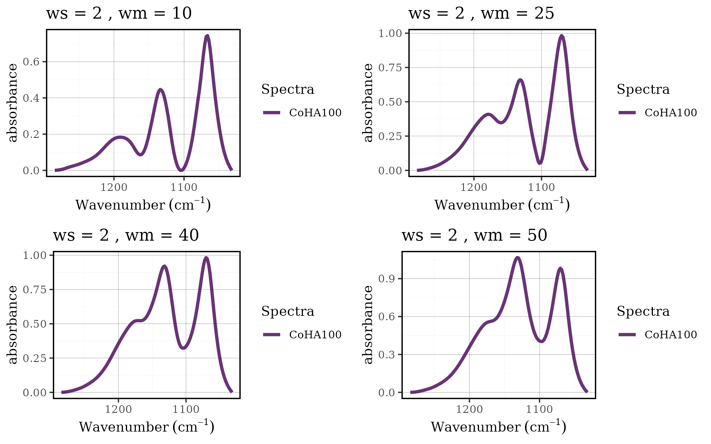

``` r
grid.arrange(grobs = df$plot[5:8], nrow = 2, ncol = 2)
```

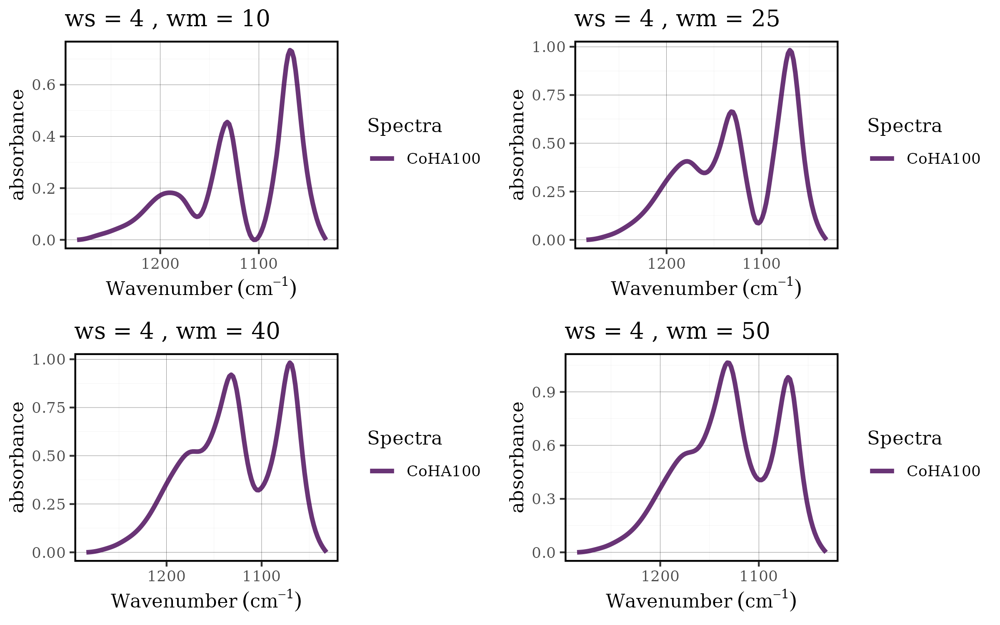

``` r
grid.arrange(grobs = df$plot[9:12], nrow = 2, ncol = 2)
```

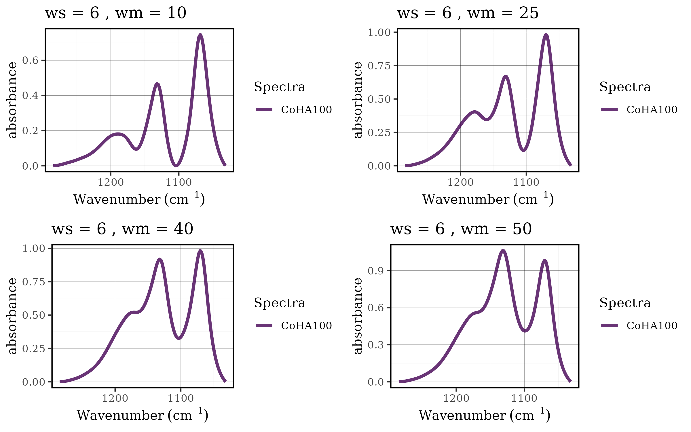

``` r
grid.arrange(grobs = df$plot[13:16], nrow = 2, ncol = 2)
```

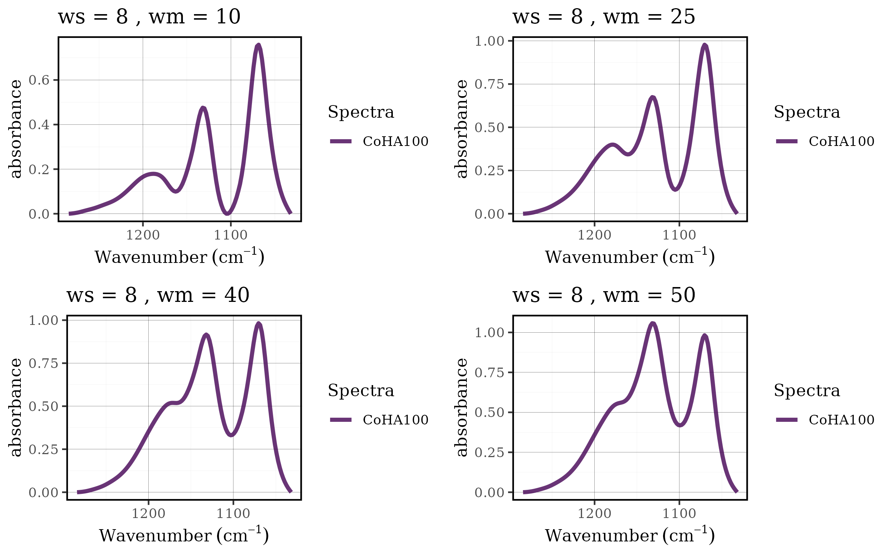

``` r
grid.arrange(grobs = df$plot[17:20], nrow = 2, ncol = 2)
```

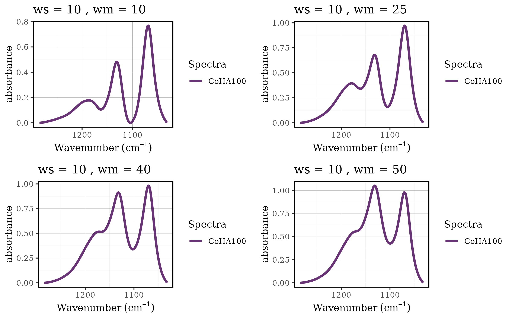

``` r
grid.arrange(grobs = df$plot[21:24], nrow = 2, ncol = 2)
```

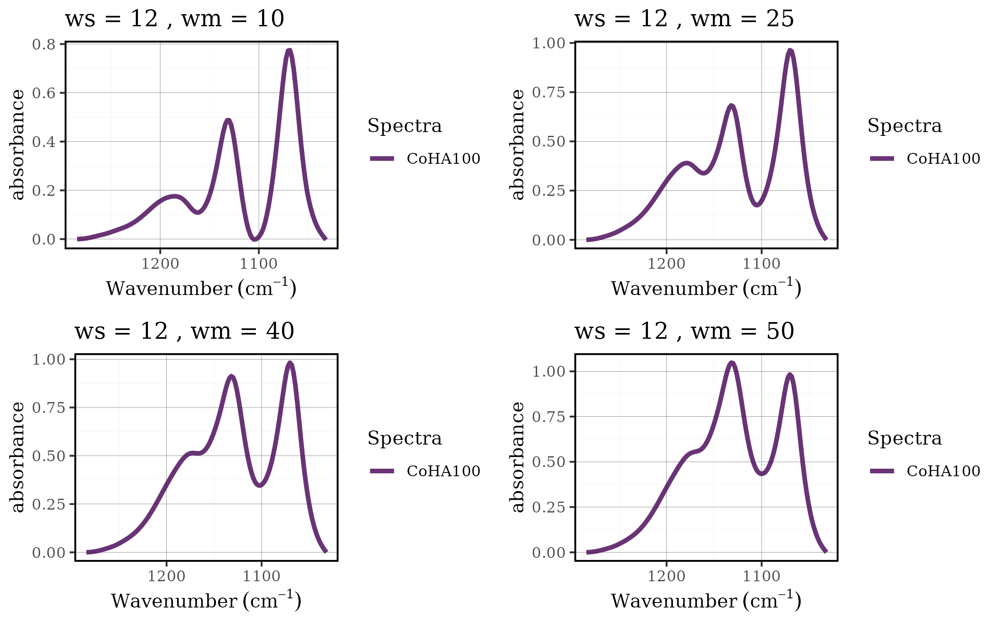

#### Benefits of the tidyverse approach

This workflow demonstrates several advantages of integrating tidyspec
with the tidyverse:

- **Scalability**: Easy to add more parameters or parameter values
- **Reproducibility**: All steps are clearly documented and can be
  easily modified
- **Efficiency**: Vectorized operations handle multiple datasets
  simultaneously
- **Flexibility**: Each step can be customized or extended as needed
- **Readability**: The pipeline structure makes the analysis workflow
  transparent

#### Extending the approach

This methodology can be extended to optimize other spectral processing
parameters:

- Smoothing parameters (window size, polynomial order)
- Normalization methods and ranges
- Derivative calculation parameters Spectral filtering ranges

The combination of tidyspec functions with tidyverse tools creates a
powerful framework for systematic spectral analysis, enabling
researchers to make data-driven decisions about preprocessing parameters
while maintaining clean, reproducible code.
